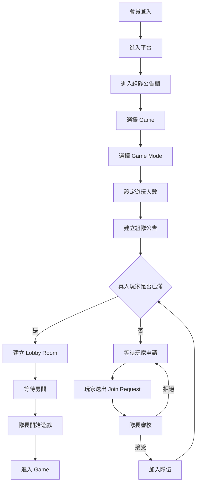

平台連結：https://gameplatform-project.onrender.com/pages/Chat/chatclient.html


# 🎮 Simple Game Platform｜簡易遊戲平台

> Java Spring Boot 多人簡易遊戲平台團隊專題

Simple Game Platform 是一個整合 **會員、遊戲大廳、組隊招募、遊戲房間、即時互動與多款小遊戲** 的 Web 平台。

本專案由團隊共同開發，各組員分別負責不同模組，並透過 REST API、資料庫與 WebSocket 進行功能整合。

---

# 📌 Project Overview

使用者登入平台後，可以：

```text
會員登入
   ↓
進入遊戲平台
   ↓
選擇遊戲
   ↓
建立 / 加入隊伍
   ↓
等待隊伍成立
   ↓
建立遊戲房間
   ↓
進入遊戲
```

平台目前包含：

* 👤 User 會員模組
* 🎮 Game Management 遊戲管理
* 👥 Board 組隊公告欄
* 🚪 Lobby / Room 遊戲房間
* 💬 Chat 聊天功能
* ♠️ Poker 遊戲
* 🃏 田忌Poker
* 🧠 Quiz 問答遊戲
* 🛒 Shop 商城模組

---

# 🛠️ Technology Stack

## Backend

| Technology      | Purpose                        |
| --------------- | ------------------------------ |
| Java            | Backend Language               |
| Spring Boot     | Backend Framework              |
| Spring MVC      | REST API                       |
| Spring Data JPA | Database Access                |
| Hibernate       | ORM                            |
| SQLite          | Development Database           |
| Maven           | Dependency Management          |
| Lombok          | Reduce Boilerplate Code        |
| Bean Validation | Request Validation             |
| Spring Security | Authentication / Authorization |
| JWT             | Login Authentication           |
| WebSocket       | Real-time Communication        |

---

# 🖥️ Frontend

本專案目前為 **混合式前端架構**。

不同模組依團隊開發需求使用不同方式實作。

包含：

```text
HTML
CSS
JavaScript
jQuery
AJAX
```

其中本人主要負責的：

# 👥 Team Recruitment / Board

採用：

```text
HTML
CSS
JavaScript
jQuery
AJAX
WebSocket
```

Board 為獨立 HTML / jQuery 頁面：

```text
frontend/src/pages/Board/
```

不需要：

```text
React
npm build
```

即可獨立進行 Board 功能開發與測試。

---


## Team Recruitment Module｜組隊公告欄

本人主要負責團隊專案中的：

```text
Board / Team Recruitment Module
```

主要目標是負責連接：

```text
User
 ↓
Game
 ↓
Game Mode
 ↓
Team Recruitment
 ↓
Player
 ↓
Lobby / Room
 ↓
Game
```

讓玩家能從「找隊伍」一路進入正式遊戲。

---

# 👥 Board 功能

## 📋 建立隊伍

隊長可以建立組隊公告。

建立時可設定：

* 公告標題
* 遊戲
* 遊戲模式
* 遊玩人數
* 預定開始時間
* 結束時間
* 語音需求
* 隊伍說明
* 段位需求
* Tags

---

# 🎮 Game / Game Mode 串接

Board 不會將遊戲名稱寫死在前端。

而是透過：

```http
GET /api/game-management/games
```

向 Game Management 模組取得目前可以使用的遊戲。

流程：

```text
Game Management Database
          ↓
       Game API
          ↓
        AJAX
          ↓
遊戲下拉選單
          ↓
使用者選擇 Game
          ↓
顯示該遊戲的 Game Mode
```

例如：

```text
田忌撲克
├── 玩家對戰
└── 對戰電腦
```

因此未來新增遊戲時，不需要重新把遊戲名稱寫死在 Board 前端。

---

# 👤 Player Count

不同 Game Mode 可以設定：

```text
minPlayers
maxPlayers
computerPlayers
```

Board 會依照遊戲模式自動產生可選人數。

例如：

```text
minPlayers = 2
maxPlayers = 4

遊玩人數：

2 人
3 人
4 人
```

如果玩家選擇：

```text
3 人
```

則當：

```text
隊長 + 核准玩家 = 3
```

時，隊伍即視為滿員。

---

# 🤖 對戰電腦

如果 Game Mode 設定：

```text
真人玩家 = 1
電腦玩家 = 1
```

例如：

```text
對戰電腦
```

隊長建立公告後即可直接達到所需真人數。

系統可以：

```text
建立公告
   ↓
立即滿員
   ↓
建立 Lobby Room
```

---

# 🙋 加入隊伍

其他玩家可以查看招募中的公告。

並送出：

```text
Join Request
```

玩家可填寫加入留言。

申請狀態包含：

```text
PENDING
APPROVED
REJECTED
CANCELLED
```

---

# 👑 隊長審核

隊長可透過：

```text
我的通知
或
隊長管理
```

查看玩家加入申請。

可以：

```text
✅ 同意

❌ 拒絕
```

當同意玩家後，系統會重新計算隊伍人數。

---

# 🚪 Team → Lobby / Room

Board 已與 Lobby 模組進行串接。

主要流程：

```text
建立公告
   ↓
等待玩家加入
   ↓
Join Request
   ↓
隊長審核
   ↓
玩家加入
   ↓
人數達標
   ↓
自動建立 Room
   ↓
加入隊長
   ↓
加入核准玩家
   ↓
等待開始
```

Board 不會直接操作 Room 資料表。

而是透過 Lobby 既有功能：

```text
LobbyController.createRoom()
LobbyController.joinRoom()
```

進行房間建立與加入。

---

# 🔄 完整組隊流程



---

# 🦶 Kick Player

隊伍滿員後，在遊戲尚未開始前：

隊長可以：

```text
踢除已核准隊員
```

踢除後：

```text
玩家移出 Room
       ↓
JoinRequest → CANCELLED
       ↓
隊伍恢復 RECRUITING
       ↓
重新招募玩家
```

重新招募完成後：

```text
沿用原本 Room
```

不會重複建立新的 Room。

---

# ▶️ Start Game

當隊伍已經準備完成：

```text
隊長
 ↓
開始遊戲
 ↓
Room 狀態更新
 ↓
Board 狀態同步
 ↓
所有玩家收到更新
 ↓
進入 Game
```

---

# 🕒 Start Time

建立公告時：

```text
開始時間
```

為必填。

前端與後端皆會避免建立：

```text
過去時間
```

後端時間驗證以：

```text
Asia/Taipei
```

為基準。

---

# 🔍 搜尋與篩選

Board 支援多條件搜尋。

包含：

```text
關鍵字
遊戲
Game Mode
公告狀態
開始時間 From
開始時間 To
```

可以組合查詢。

例如：

```text
遊戲：田忌撲克
模式：玩家對戰
狀態：招募中
時間：18:00～23:00
```

---

# 📄 Pagination

目前以下功能皆支援分頁：

```text
公告列表
留言
通知
```

每頁：

```text
10 筆
```

提供：

```text
上一頁
下一頁
目前頁
總筆數
```

---

# 💬 Comment

玩家可以在公告詳細頁：

* 查看留言
* 新增留言
* 刪除自己的留言

留言更新會同步通知相關玩家。

---

# ⭐ Favorite

玩家可以：

```text
收藏公告
取消收藏
查看自己的收藏
```

收藏的公告也會納入通知關係判斷。

---

# 🔔 Notification System

Board 已加入通知系統。

通知分類為：

```text
我的隊伍
我申請加入
我關注的公告
```

---

## 我的隊伍

主要提供隊長查看：

* 新加入申請
* 隊伍人員狀態
* 公告留言
* 遊戲開始相關通知

---

## 我申請加入

提供玩家查看：

* 申請審核結果
* 隊伍開始
* 新留言
* Room 入口

---

## 我關注的公告

包含：

* 收藏的公告
* 曾留言的公告

可以收到後續留言相關通知。

---

# 🔴 Unread Notification

平台上方：

```text
我的通知
```

會顯示未讀數字。

使用者可以：

```text
標記單則已讀
標記目前頁面已讀
```

---

# ⚡ WebSocket

Board 使用：

```text
/ws/board
```

處理即時更新。

包含：

* 公告更新
* 留言更新
* Join Request
* 隊長審核
* 通知
* 隊伍人數
* 遊戲開始

---

## WebSocket Authentication

訪客：

```text
只能接收公開公告更新
```

已登入會員：

```text
JWT
 ↓
AUTH Message
 ↓
WebSocket Server
 ↓
驗證會員
 ↓
接收私人通知
```

JWT 不會直接放在 WebSocket URL。

---

# 🔐 User Login Integration

Board 使用 User 模組的登入機制。

登入流程：

```text
User Login
   ↓
JWT Token
   ↓
GET /api/user/auth/me
   ↓
Board Auth Session
   ↓
取得 Board Member
```

Board 使用：

```http
POST /board/auth/session
```

將 User 模組會員與 Board Member 建立關聯。

---

# 🧩 User / Board Member 關聯

Board 不會直接將：

```text
User.userId
```

當成：

```text
Board.memberId
```

而是使用：

```text
platformUserId
```

建立兩個模組會員資料的對應關係。

---

# 🏗️ Backend Architecture

Board 後端主要架構：

```text
Controller
   ↓
DTO
   ↓
Validation
   ↓
Service
   ↓
Repository
   ↓
Entity
   ↓
SQLite
```

---

# 🗂️ Board Backend Structure

```text
modules/board
│
├── controller
│
├── service
│
├── repository
│
├── entity
│
├── dto
│
├── config
│
└── server
```

---

# 📂 Project Structure

```text
game
│
├── backend
│   │
│   ├── pom.xml
│   ├── gameplatform.db
│   │
│   └── src/main
│       │
│       ├── java/com/example/demo
│       │   │
│       │   └── modules
│       │       │
│       │       ├── board
│       │       ├── user
│       │       ├── lobby
│       │       ├── chat
│       │       ├── shop
│       │       │
│       │       └── game
│       │           ├── management
│       │           ├── poker
│       │           ├── tjpoker
│       │           └── quiz
│       │
│       └── resources
│           └── application.properties
│
└── frontend
    │
    ├── src
    │   │
    │   ├── pages
    │   │   │
    │   │   ├── Board
    │   │   │   ├── index.html
    │   │   │   └── assets
    │   │   │       ├── app.js
    │   │   │       ├── board-utils.js
    │   │   │       ├── realtime.js
    │   │   │       └── style.css
    │   │   │
    │   │   ├── Lobby
    │   │   ├── Games
    │   │   ├── User
    │   │   └── Chat
    │   │
    │   ├── App.jsx
    │   └── main.jsx
    │
    ├── package.json
    └── vite.config.js
```

---

# 🗄️ Database

目前後端主要使用：

```text
SQLite
```

設定：

```properties
spring.datasource.url=jdbc:sqlite:gameplatform.db
spring.datasource.driver-class-name=org.sqlite.JDBC

spring.jpa.database-platform=org.hibernate.community.dialect.SQLiteDialect
spring.jpa.hibernate.ddl-auto=update
```

SQLite 資料庫：

```text
backend/gameplatform.db
```

---

# 🔗 Board API

## Game / Game Mode

```http
GET /api/game-management/games
```

---

## 公告列表

```http
GET /board/team-posts
```

---

## 公告分頁

```http
GET /board/team-posts/page
```

例如：

```http
GET /board/team-posts/page?page=0
```

---

## 公告搜尋

```http
GET /board/team-posts?gameId=1&modeId=2&status=RECRUITING&keyword=poker
```

---

## 查看單一公告

```http
GET /board/team-posts/{id}
```

---

## 建立公告

```http
POST /board/team-posts
```

---

## 修改公告

```http
PUT /board/team-posts/{id}
```

---

## 刪除公告

```http
DELETE /board/team-posts/{id}
```

---

## 玩家申請加入

```http
POST /board/team-posts/{id}/join
```

---

## 隊長查看申請

```http
GET /board/applications/captain/{id}
```

---

## 玩家查看自己的申請

```http
GET /board/applications/member/{id}
```

---

## 審核申請

```http
PUT /board/applications/{id}/APPROVED
```

或：

```http
PUT /board/applications/{id}/REJECTED
```

---

# 💬 Comment API

```http
GET /board/team-posts/{id}/comments
```

分頁：

```http
GET /board/team-posts/{id}/comments/page?page=0
```

新增：

```http
POST /board/team-posts/{id}/comments
```

刪除：

```http
DELETE /board/comments/{id}
```

---

# ⭐ Favorite API

```http
POST /board/team-posts/{postId}/favorite/{memberId}
```

取得會員收藏：

```http
GET /board/favorites/member/{id}
```

---

# 🔔 Notification API

取得通知：

```http
GET /board/notifications
```

通知摘要：

```http
GET /board/notifications/summary
```

標記已讀：

```http
PUT /board/notifications/read
```

---

# 🚪 Room API

取得公告對應房間：

```http
GET /board/team-posts/{id}/room
```

---

## Kick Player

```http
POST /board/team-posts/{id}/kick
```

---

## Start Game

```http
POST /board/team-posts/{id}/start
```

---

## Get Game Entry

```http
GET /board/team-posts/{id}/game
```

---

# 🚀 Running the Project

## Backend

進入：

```bash
cd backend
```

啟動：

```bash
./mvnw spring-boot:run
```

Windows：

```bash
mvnw.cmd spring-boot:run
```

也可以使用 Eclipse：

```text
GameplatformApplication.java
→ Run As
→ Spring Boot App
```

Backend：

```text
http://localhost:8080
```

---

# 👥 Running Board

Board 不需要 React Build。

使用 VS Code 開啟：

```text
frontend/src/pages/Board/index.html
```

使用：

```text
Live Server
```

啟動即可。

⚠️ 請勿直接使用：

```text
file://
```

開啟 HTML。

---

# 🔄 Board Architecture

```text
index.html
   ↓
jQuery
   ↓
app.js
   ↓
AJAX / UserApi
   ↓
Spring Boot REST API
   ↓
Board Controller
   ↓
Service
   ↓
Repository
   ↓
SQLite
```

即時功能：

```text
Board
   ↓
WebSocket
   ↓
/ws/board
   ↓
Spring Boot
```

---

# 🧪 Testing

Board 已建立整合測試。

例如：

```bash
cd backend

sh ./mvnw -Dtest=BoardRoomIntegrationTests test
```

測試內容包含：

* 單人模式立即建立 Room
* 多人隊伍滿員建房
* 重複審核防護
* 超收防護
* Room 建立失敗 Rollback
* Game / Mode 驗證
* 玩家人數限制
* Notification
* Kick Player
* Start Game
* WebSocket
* Board → Poker
* SQLite 資料庫更新

---

# 🎯 My Learning Outcomes

透過 Team Recruitment Module，我實際練習：

### Backend

* Java
* Spring Boot
* MVC
* REST API
* DTO
* Validation
* Service
* Repository
* JPA
* Entity Relationship
* SQLite
* Transaction

### Frontend

* HTML
* CSS
* JavaScript
* jQuery
* AJAX
* DOM 操作
* REST API Integration
* WebSocket

### System Integration

* User → Board
* Game → Game Mode
* Board → Lobby
* Team → Room
* Room → Game
* JWT Authentication
* Module Integration

### Team Development

* Git
* GitHub
* Sourcetree
* Branch Development
* API Integration
* Team Collaboration

---

# 💡 My Module Role

Team Recruitment 不只是 CRUD 公告功能。

它在整體平台中扮演：

```text
User
 ↓
Game
 ↓
Team Recruitment
 ↓
Team Matching
 ↓
Lobby
 ↓
Game Room
 ↓
Game
```

也就是負責將：

```text
使用者
遊戲
玩家
隊伍
房間
```

整合在同一條使用流程中。

---

# 🔮 Future Improvements

* [ ] 更多遊戲接入 Board → Lobby 流程
* [ ] 多 Server WebSocket Message Broker
* [ ] 更完整的好友系統
* [ ] 玩家戰績
* [ ] 排行榜
* [ ] RWD 優化
* [ ] 正式 MySQL / Cloud Database
* [ ] Render / Cloud Deployment
* [ ] Swagger API Documentation
* [ ] CI / Automated Testing

---

# 👥 Project Type

```text
Java Full Stack Team Project
```

本專案用於：

* Java 全端課程專題
* 團隊共同開發
* GitHub 程式碼管理
* 作品集展示
* 面試專案說明

---

## 📄 License

```text
Educational / Portfolio Project
```

本專案主要供課程學習、技術交流與作品展示使用。

---

⭐ **Simple Game Platform**

A Java Spring Boot multiplayer game platform integrating users, team recruitment, game modes, lobby rooms and multiplayer games.
